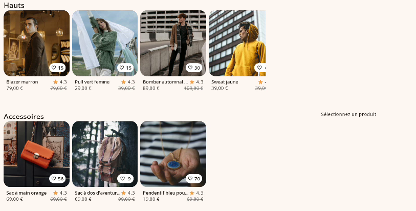

Joiefull app
=====================

Clothing and accessories catalog app. Products can be liked, rated and shared.
Made as part of the OpenClassrooms Android course.

Tech stack
------------

- Android Studio
- Gradle 9.1.0
- Kotlin 2.3.20
- Kotlin Coroutines 1.10.2
- Jetpack Compose 2026.03.01 (BOM)
- Koin 4.2.1
- Retrofit 3.0.0
- Moshi 1.15.2
- Coil 3.4.0

App is tested with JUnit 5 and Mockk.

API
--------------

Data are provided by demo API :
https://github.com/OpenClassrooms-Student-Center/D-velopper-une-interface-accessible-avec-Jetpack-Compose

Screenshots
---------------

